# Farnsworth Fusor Power Supply
## Overview
Here we present a design for a 400W 120VrmsAC 60Hz -> 33kVDC Power Converter; to power an automated Farnsworth Fusor. Relevant Power Converter control I/Os are configured to be digitally accessible by a host computer to enable remote control & monitoring. 

The power converter has four stages: a passive rectifier, an inverter (18kHz) driven by complementary PWM, a ferrite UU core 1:30 transformer, and an 8x voltage multiplier.There are four PCBs in the design, described below. 

## Status Update
Recently achieved -20kVDC output at open load from 40VAC input (open-loop control), using a VFD borrowed from a professor. Arcing occured at this voltage, working on re-insulating. Currently redesigning switcher (migrating from IGBTs to SiC and from PIC 18F micro to TI C2000 series), implementing the i control loop, and doing a design study on an optimal transformer with evolutionary computing methods. It is a passion project that takes a backseat to my other commitments, so I am expecting it to take years. 

## Integrated Supply
3D model of the power supply assembly and current build state. 

   

## LTSpice Transient Model
This model was used to verify output voltage, tune dead time, and determine DC link/voltage multiplier capacitances. 

 

## LLC Stage
### Modeling of Transformer
Leakage inductance Lr and magnetizing inductance Lm were derived from an Ansys FEA, and measured with the RidleyBox Frequency Response Analyzer. Ansys FEA results were Lr=11.2uH and Lm=2.63mH. RidleyBox measurements were Lr=200uH and Lm=2.50mH. Measured magnetizing inductance was close to predicted, but Ansys FEA did not correctly account for leakage paths. 

The red RidleyBox sweep is Lm (XF secondary open) and the blue sweep is Lr (XF secondary shorted). 

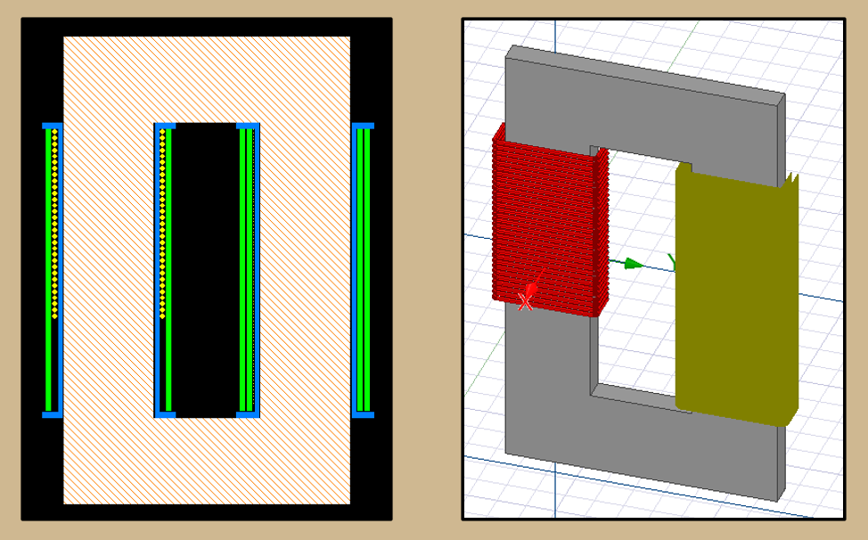  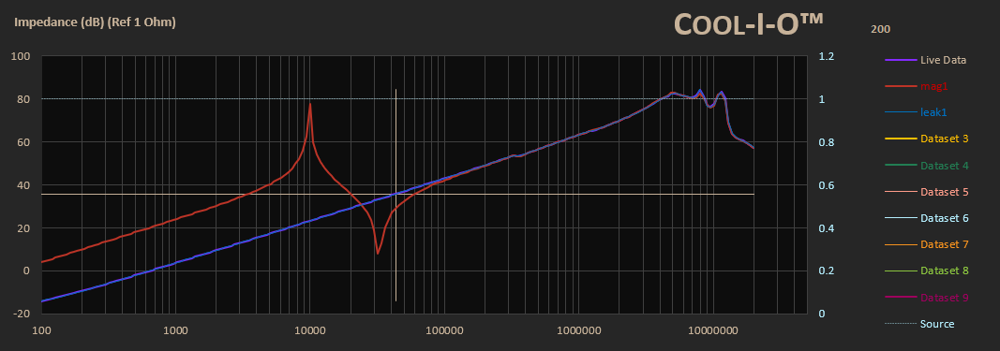 

These results were used to simulate LLC gain curves and create a feedforward function for the H-bridge control loop which calculates required frequency for a desired LLC-stage output voltage.

### LLC Gain Curves (Lr and Lm from Ansys FEA)
Two models were used to derive LLC gain curves: a FHA computed with MATLAB and an LTSpice AC analysis. These models were used to determine a suitable resonant capacitor and series L (to add in series with Lr) to achieve desired gain curve. The series L was required since the fusor load is very light, damping series resonant peak. A peaky resonance is desired so the required output voltage range is attainable in a smaller range of frequencies. An L of 800uH (200uH Lr + 600uH series L) and C of 250nF resulted in desired series resonant frequency (fsr).

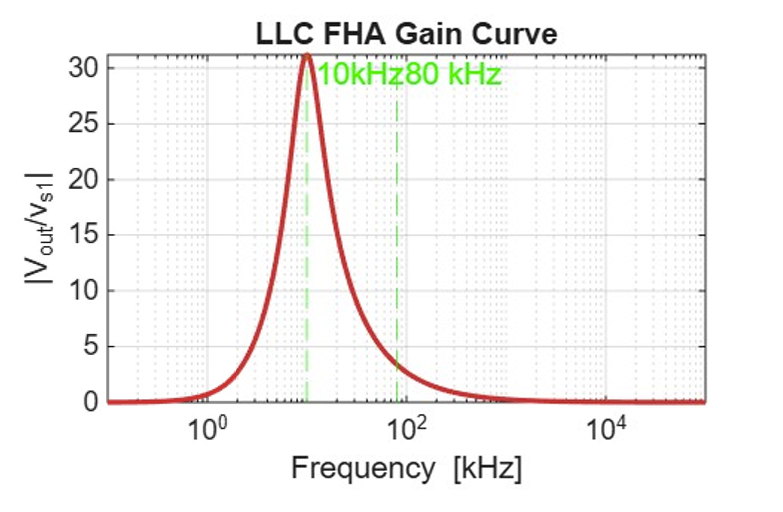  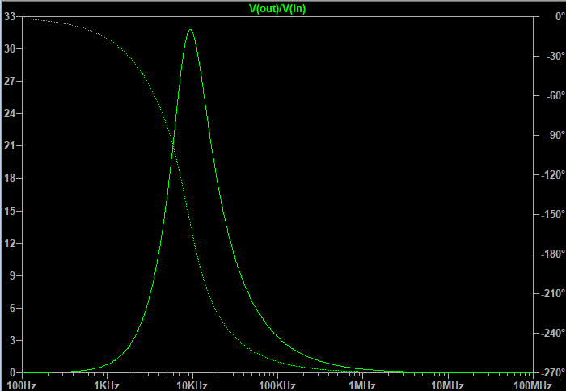 

### LLC Gain Curves (Lr and Lm measured with RidleyBox)
LT Spice has been used to simulate the LLC gain curve, including parasitics measured by RidleyBox. Next steps are to update MATLAB state-space model and feedforward function. 

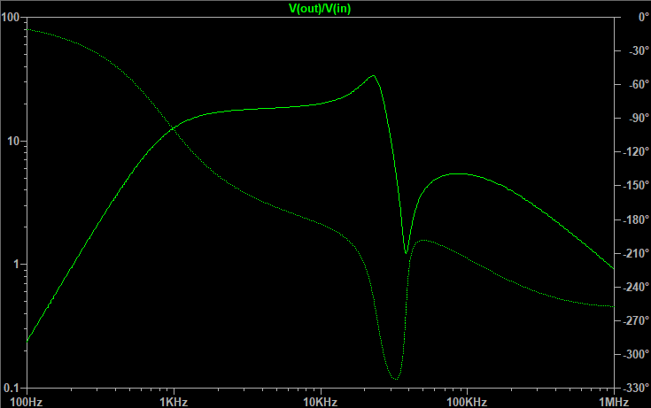

## Control System
### Simulink Models
The plan is to use a Simulink model of the power converter to validate the power supply control loop, then use the C2000 Toolbox to flash the control loop onto a TI C2000 microcontroller. The control architecture being pursued is an MPC calculating the least energy path from measured current i to desired current i. The goal is to use the IV curve of a Townsend Avalanche in series with the voltage-to-frequency function to calculate required frequency as a function of i_error. 

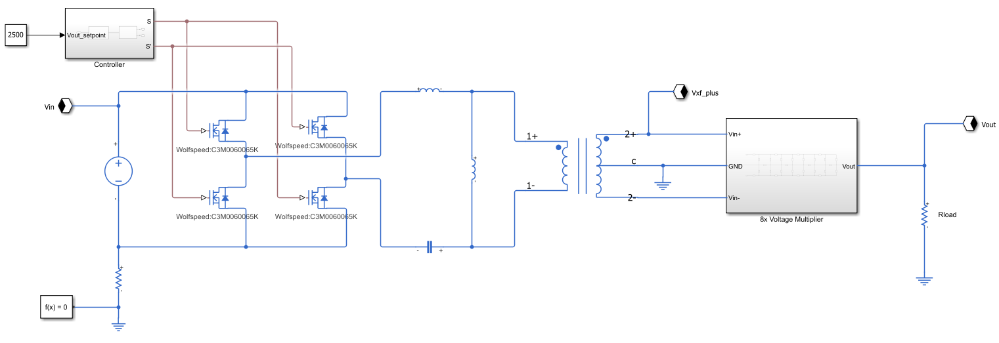

## Hardware
### Rectifier and Inverter PCB
This PCB includes the rectifier, switcher and series capacitor for LLC stage. The design had several issues that are being fixed. 
#### Top-Level Schematic
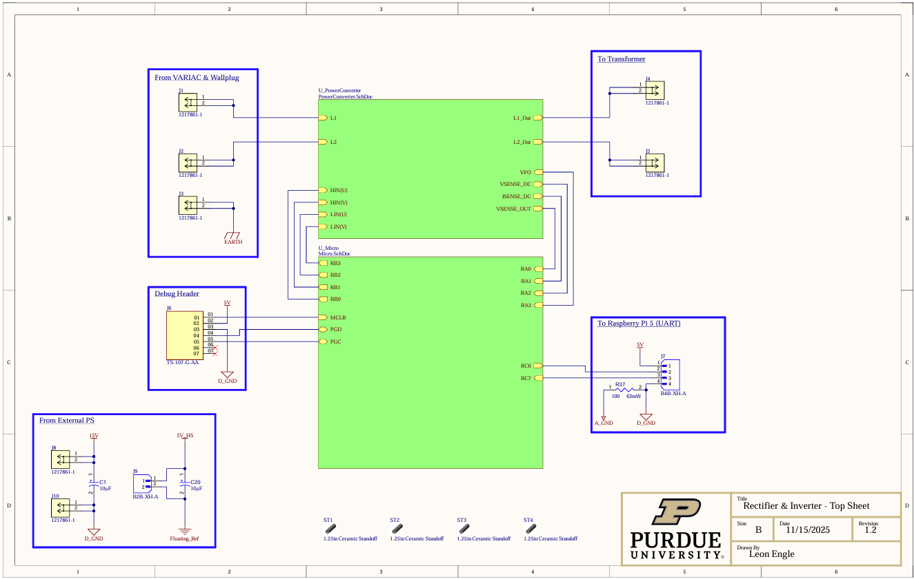 

#### Rectifier & Inverter Schematic
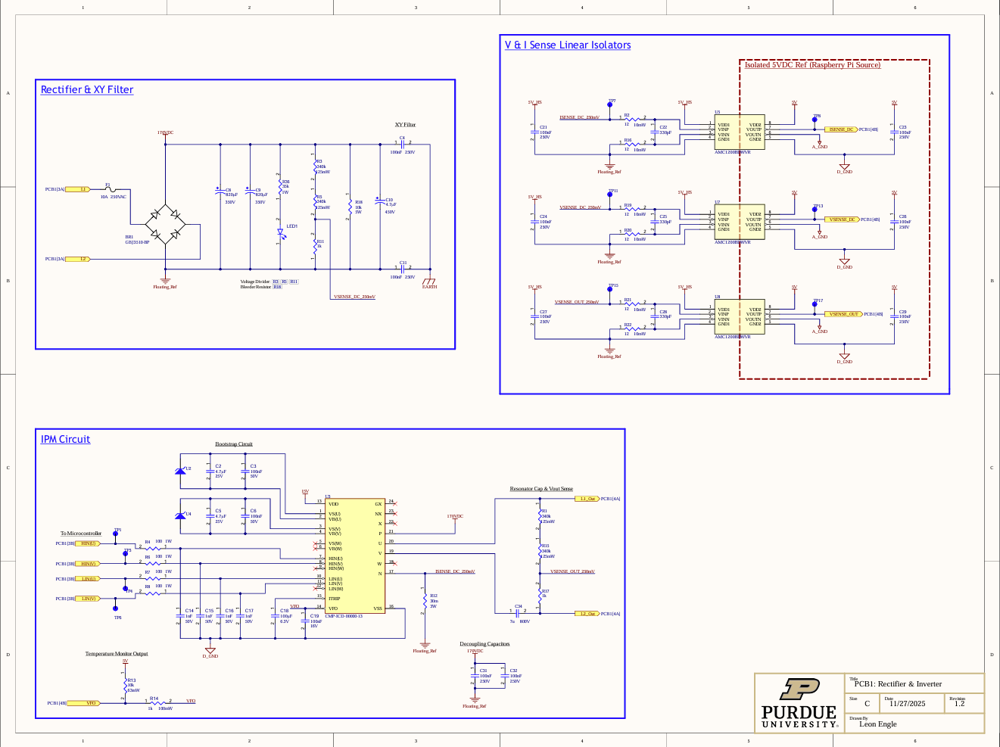 

#### Microcontroller Schematic
 

#### 2D & 3D View of PCB
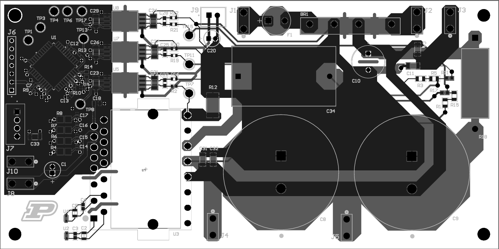  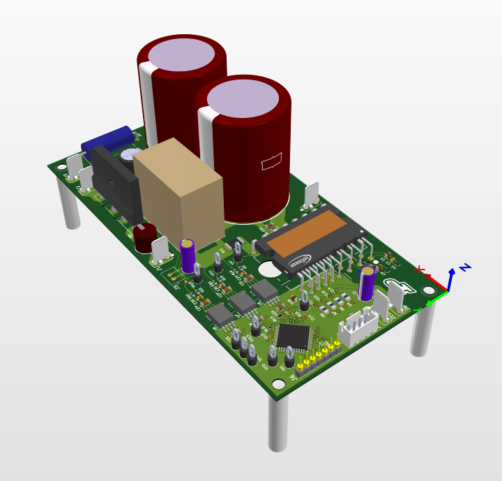 

### Voltage Multiplier PCB
#### Top-Level Schematic
 

#### 2D & 3D View of PCB
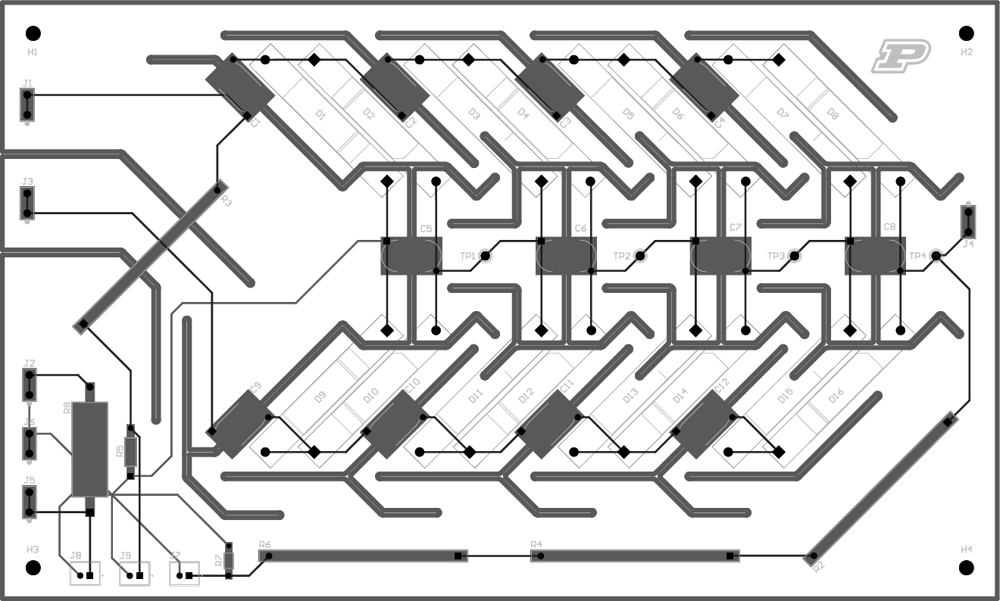   

### Transformer Design
Bobbins and equations used to design transformer. UU core, wound non-concentrically to increase leakage inductance for LLC. Litz wire on primary. 
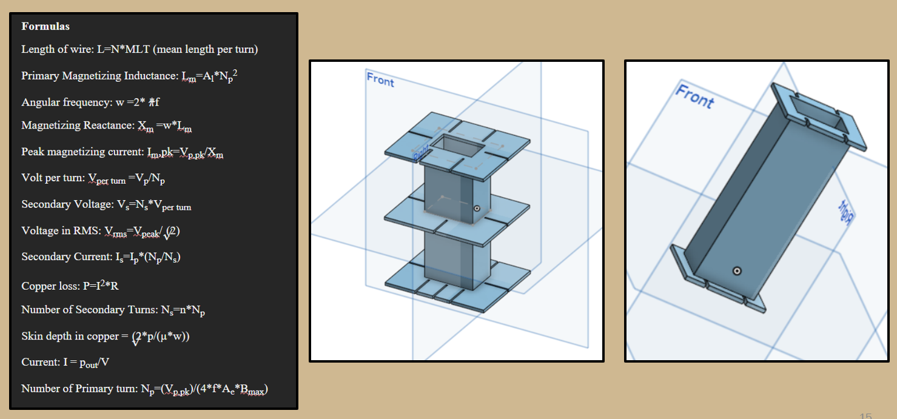 
