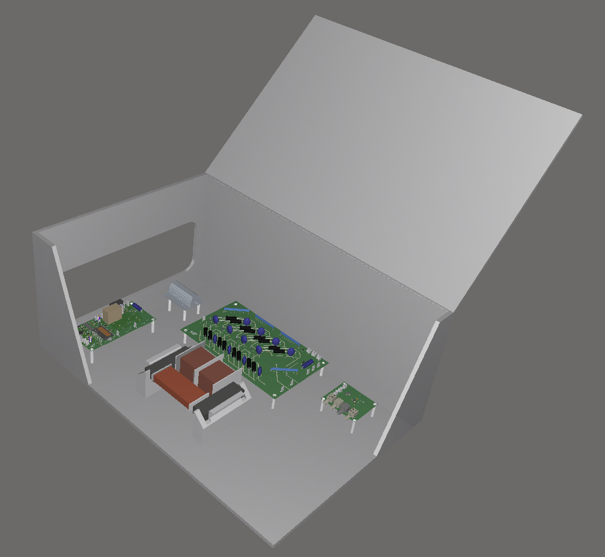
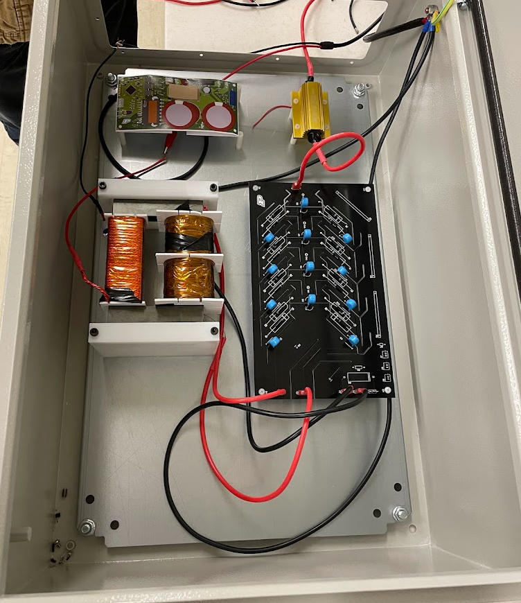
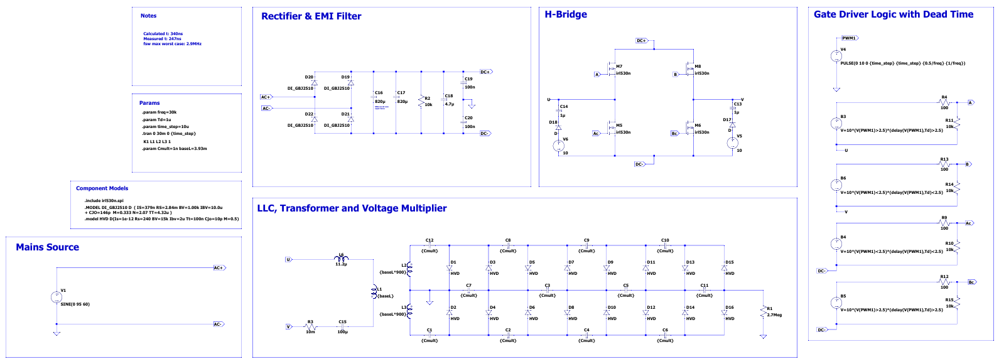
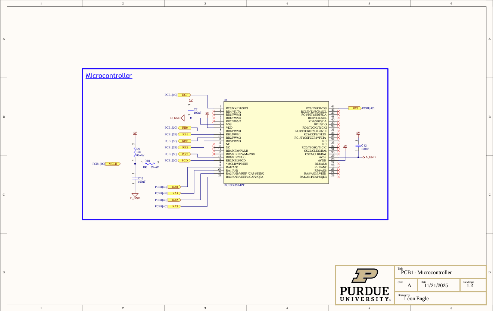
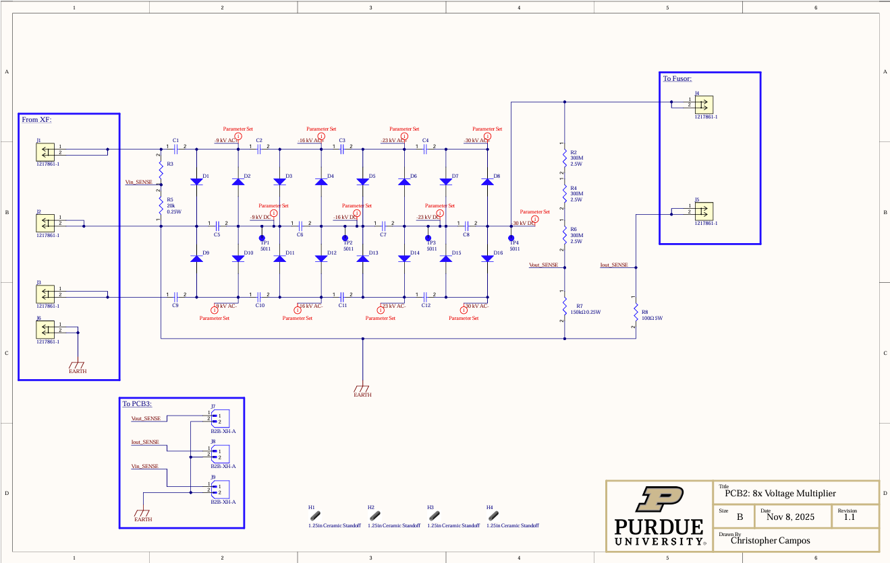
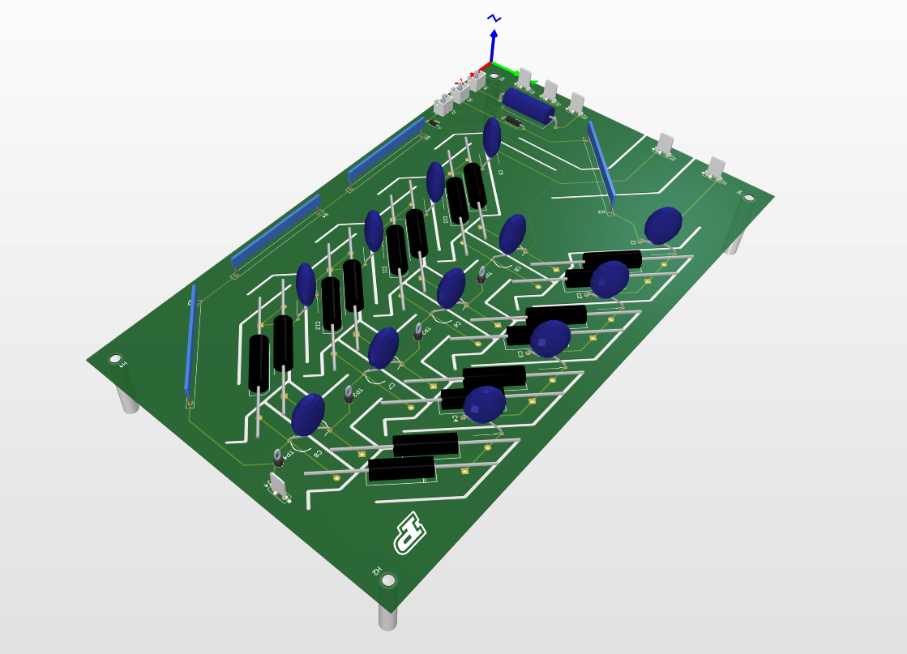

# FarnsworthFusor_PowerSystem
## Overview
Here we present a design for a 400W 120VrmsAC 60Hz -> 33kVDC Power Converter; to power an automated Farnsworth Fusor. Relevant Power Converter control I/Os are configured to be digitally accessible by a host computer to enable remote control & monitoring. 

The power converter has four stages: a passive rectifier, an inverter (18kHz) driven by complementary PWM, a ferrite UU core 1:30 transformer, and an 8x voltage multiplier.There are four PCBs in the design, described below. 

## Status Update
Recently achieved -20kVDC output at open load from 40VAC input, Q from resonator was higher than expected from simulation. Arcing occured at this voltage, working on re-insulating to prevent future firework displays. 

## Integrated Supply
   

## LTSpice Model
 

## PCB1: Passive Rectifier & 18kHz Inverter
### Top-Level Schematic
 

### Rectifier & Inverter Schematic
 

### Microcontroller Schematic
 

### 2D & 3D View of PCB
   

## PCB2: 8x Voltage Multiplier, V&I Sense
### Top-Level Schematic
 

### 2D & 3D View of PCB
   

## PCB3: DAQ1 & Fiber-Optic SPI Node

## PCB4: Raspberry Pi 5 <-> Fiber-Optic SPI Node, DAQ2 & UART Node
