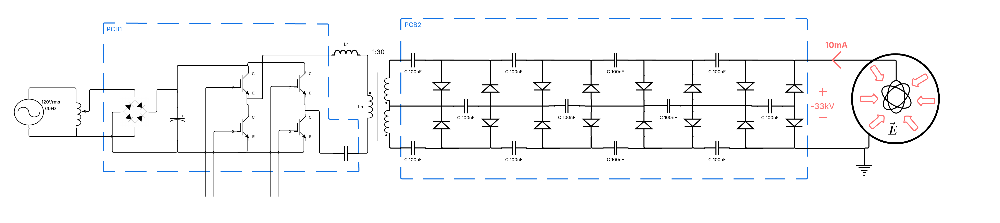
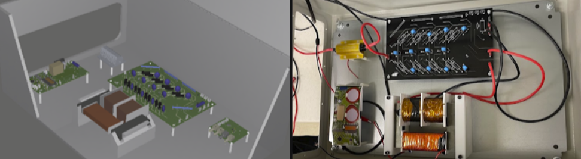
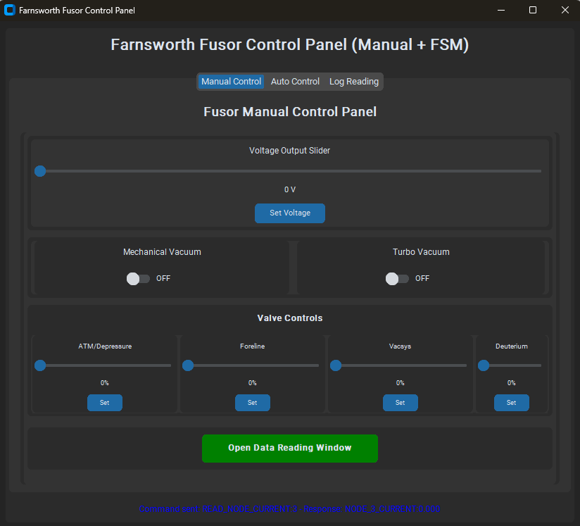
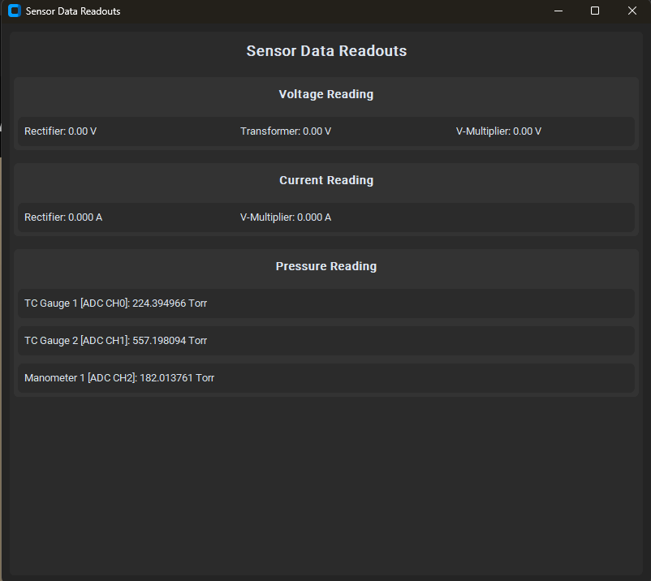
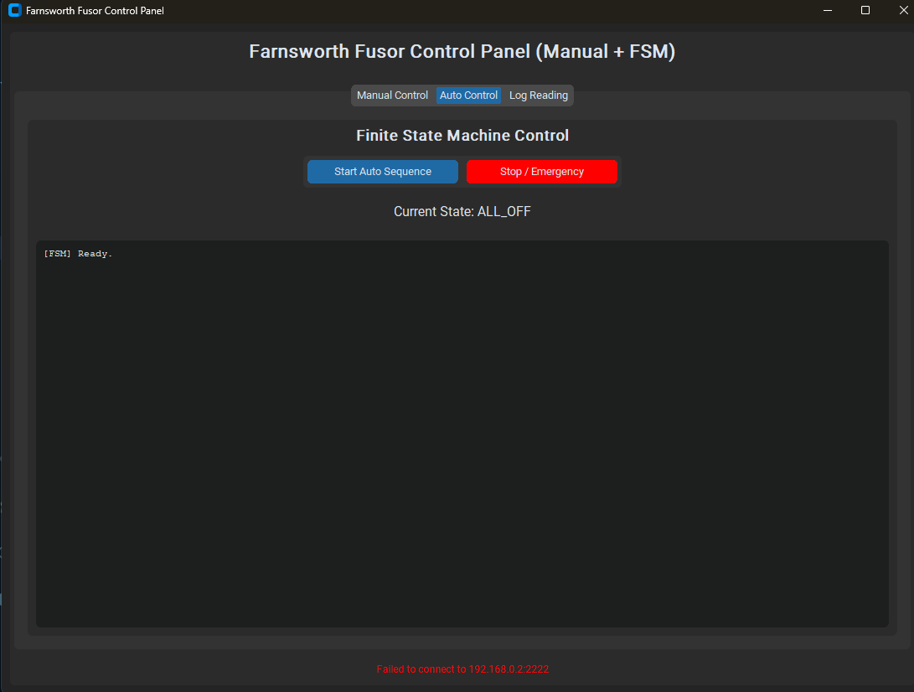
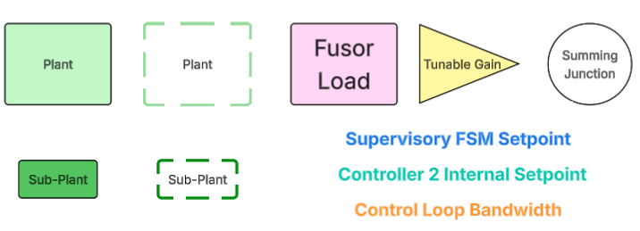
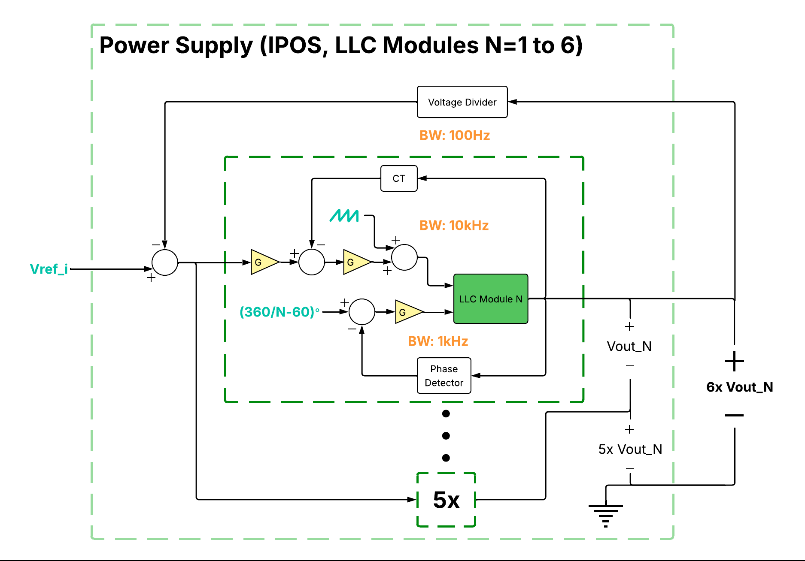
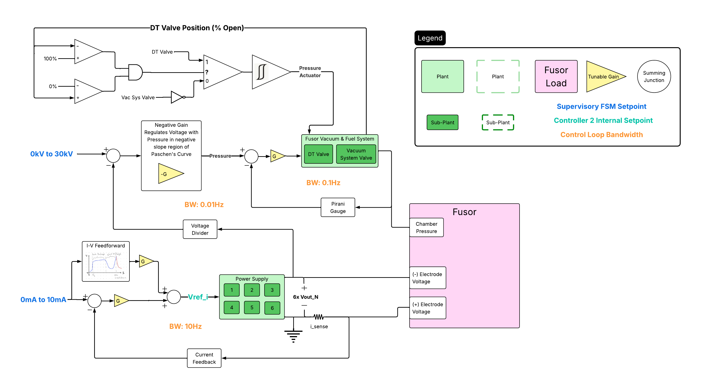
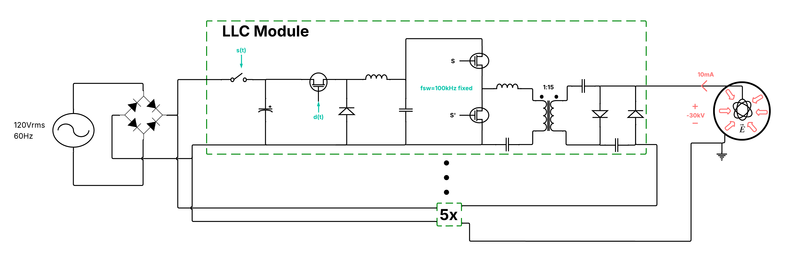

# Automated Farnsworth Fusor

## Overview

This repository contains the design (in progress) of a Farnsworth Fusor control system and power supply design supporting automatic control of operations from startup to neutron production to shutdown.

## Power Supply Design 1

The first power supply design was a 400W 120VrmsAC 60Hz -> -33kVDC Power Converter; to power a Farnsworth Fusor. The power converter has four stages: a rectifier, an inverter, a ferrite 1:30 transformer, and an 8x voltage multiplier. Recently achieved -20kVDC output with XF and Voltage Multiplier stages at open load from 40VAC input (open-loop control), using a VFD borrowed from a professor. The switcher has not been fabricated yet due to financial reasons but shouldn't fatally destruct in theory.

  
   
  <em>Fig. 1 &mdash; Power Supply Design 1: rectifier, inverter, 1:30 ferrite transformer, and 8x voltage multiplier.</em>

  
   
  <em>Fig. 2 &mdash; Prototype hardware for Power Supply Design 1.</em>

## Control System Architecture

A Supervisory Control and Data Acquisition (SCADA) System written in Python allows the user to monitor the fusor and activate emergency shutdown procedures. A manual control panel is included for controller tuning purposes.

  
  
  
   
  <em>Fig. 3 &mdash; SCADA interface: monitoring dashboard, manual control panel, and shutdown/alarm view.</em>

The SCADA implements a Finite State Machine (FSM) which iterates through the startup and shutdown process, defining setpoints for the two downstream control loops.

### Controller 1

Controller 1 regulates fusor pressure when the power supply is de-energized. The legend applies to the control loops below as well.

  
  
   
  <em>Fig. 4 &mdash; Controller 1: fusor pressure regulation with the power supply de-energized.&nbsp;&nbsp;&nbsp;&nbsp;Fig. 5 &mdash; Legend for the control loop block diagrams.</em>

### Controller 2

Controller 2 regulates fusor pressure, current and voltage while the power supply is energized. This control system has been designed to support Power Supply Design 2. There are 6 control loops with varying bandwidths:

- 10kHz BW Current Loop (Fig. 6): regulates buck converter inductor current, to ensure adequate phase and gain margin of the individual bucks.
- 1kHz BW PLL (Fig. 6): ensures the 6 IPOS modules are 60 degrees out of phase with each other, minimizing output ripple.
- 100Hz BW Voltage Loop (Fig. 6): regulates aggregate output voltage of all IPOS modules according to a setpoint determined by the 10Hz current loop.
- 10Hz BW Current Loop (Fig. 7): configures the IPOS power supply as a current source for the fusor. A feedforward path whose transfer function T(s) is the IV curve of a plasma predicts the power supply output voltage that will result in the intended current. A PI loop minimizes remaining error.
- 0.1Hz BW Pressure Loop (Fig. 7): regulates pressure in the fusor chamber to match the setpoint determined by the 0.01Hz BW Voltage Loop. Both the Deuterium Supply Valve and Vacuum System Valve may be used to regulate pressure. It is desired to use fuel injection rate to regulate pressure, so when the Deuterium Supply Valve is not fully open or fully closed, it is chosen as the pressure actuator. Otherwise, the Vacuum System Valve is used to adjust pressure. Before turning on Controller 2, the Vacuum System Valve is used to establish a baseline pressure such that the Deuterium Supply Actuator shouldn't saturate.
- 0.01Hz BW Voltage Loop (Fig. 7): uses pressure to regulate the voltage over a long time-horizon. Paschen's Curve relates pressure-distance to Voltage and forms a parabola. Thus, a PI loop with negative gain can increase Voltage by decreasing pressure (since the fusor current is fixed by the 100Hz BW Current Loop), and vice versa. The initial pressure when the power supply is energized is chosen to be at the Paschen minimum (which I plan to empirically derive), to minimize the PI loop's time in the operating region where increasing pressure increases breakdown voltage.

  
  
   
  <em>Fig. 6 &mdash; Controller 2 inner loops: 10kHz current, 1kHz PLL, 100Hz voltage.&nbsp;&nbsp;&nbsp;&nbsp;Fig. 7 &mdash; Controller 2 outer loops: 10Hz current, 0.1Hz pressure, 0.01Hz voltage.</em>

## Power Supply Design 2

Each IPOS module will consist of a buck converter feeding an LLC resonator driven at its series resonant frequency. The biggest design challenge I foresee is development of a 1:15 transformer with 30kV isolation between primary and secondary. The block diagram is a very early first pass.

  
   
  <em>Fig. 8 &mdash; Power Supply Design 2: IPOS module block diagram (early first pass).</em>

